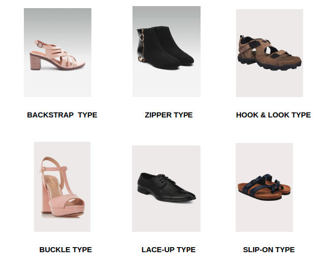
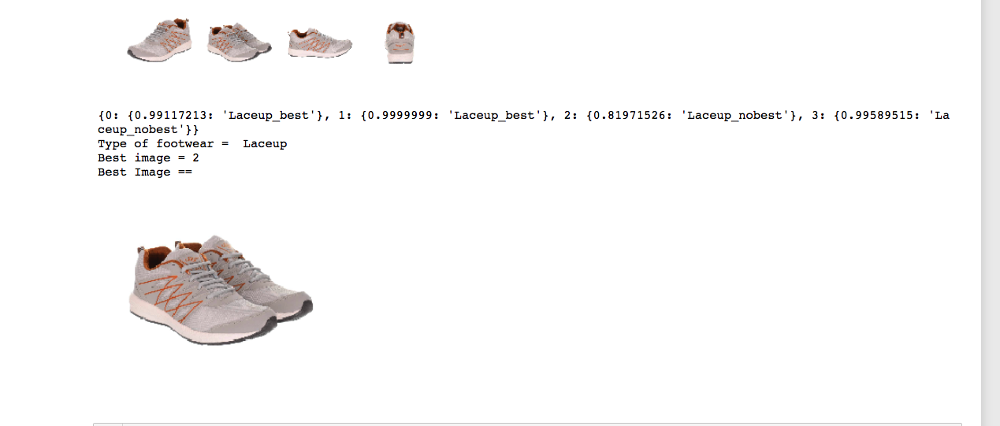
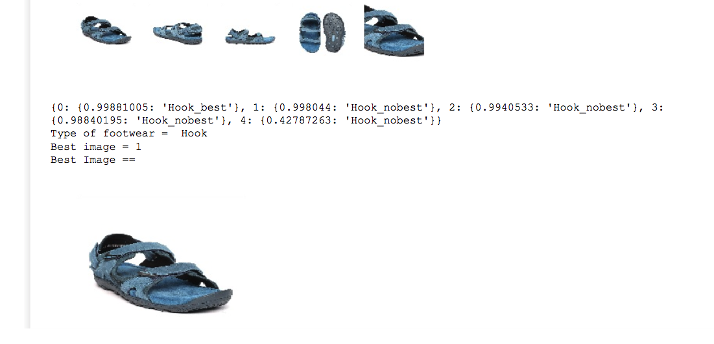
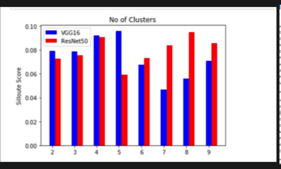
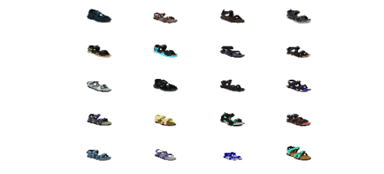

# Best-View and Footwear Classification 

 Each product has multiple views (front, left, right, back) and only a few views have the information about the product through which we can make the ML model learn its features. So a ML model which selects the specific view from given set of different views will be quite helpful . 

 Example : In the case of footwear, Side view(left/right) has most information regarding the type of heel (high, medium or flat).Similarly, different views have different information for each use case.
 
Why this is useful ?
- Imagine you are buying a lace-up shoes from amazon and the thumbnail image of shoe must be front or side facing view . If the thumbnail image is the sole of the footwear than the customer won't be able to know the details of the footwear .
- When training a model for classification task like to identify the type of image (lace-up , heel type of footwear) , it will be helpful if we pass the best view image from all the views to train the model . 

## Trained the model to identify the best view and classify the type of footwear on particular closures :
- Backstrap
- Zipper
- Hook & Loop
- Buckle
- Lace-up
- Slip-on

## Example :

- 

- 

## Approach :

- Used unsupervised methods like KMeans to cluster the same view images together . Feed the features from ResNet50 into KMeans clustering algorithm to cluster the sameview images together .  ResNet was performing better as compared to different architectures . 

- 

- 

- Trained VGG16 on best and no best views of a particluar type of footwears  . 

